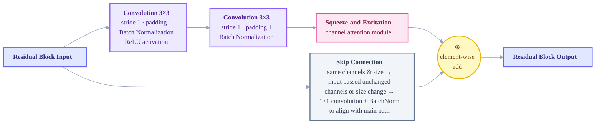

# Hackathon-IML

**Image classification on a 20-class ImageNet subset** — HUJI Introduction to Machine Learning hackathon project.

We built and trained a **SE-ResNet-18** CNN from scratch in PyTorch, with heavy data augmentation and a reproducible stratified train/val/test protocol.

---

## Team

- Shahar Paltiel
- Inbal Sela
- Yahli Zamero
- Aderet Sebbagh

---

## Task

Classify images into **20 ImageNet-1K classes** (mapped to local labels `0–19`).

Examples: `goldfish`, `tiger`, `castle`, `pizza`, `laptop`, `daisy`, and more — see [`labels.py`](labels.py) and [`dataset/labels.json`](dataset/labels.json).

| Property | Value |
|----------|-------|
| Input size | `3 × 224 × 224` |
| Normalization | ImageNet mean/std |
| Output | 20 class logits → `argmax` |
| Training images | ~20,000 (plus extra HF samples in final run) |
| Held-out test | 10% per class (never used during development) |

---

## Architecture

**SE-ResNet-18** — a deep network that learns image features in stages, with a small **attention module (SE)** in each block that tells the network which feature channels matter most.

> **How to read the chart:** data flows **left → right**. Each box shrinks or enriches the image representation until we get **20 class scores** at the end.

```mermaid
%%{init: {
  'theme': 'base',
  'themeVariables': {
    'fontFamily': 'Segoe UI, Trebuchet MS, Helvetica Neue, Arial, sans-serif',
    'fontSize': '15px',
    'primaryTextColor': '#1e293b',
    'lineColor': '#94a3b8',
    'clusterBkg': '#f8fafc',
    'clusterBorder': '#cbd5e1',
    'titleColor': '#334155'
  },
  'flowchart': { 'curve': 'basis', 'padding': 12, 'nodeSpacing': 28, 'rankSpacing': 48 }
}}%%
flowchart LR
    IN["<b>INPUT</b><br/>RGB image<br/>224×224 pixels<br/>3 color channels"]

    subgraph STEM["STEM · entry convolution layers"]
        direction LR
        ST1["<b>Convolution</b><br/>kernel 7×7<br/>stride 2 · padding 3<br/>3 → 64 channels"]
        ST2["<b>Batch Normalization</b><br/>+<br/><b>ReLU</b>"]
        ST3["<b>Max Pooling</b><br/>kernel 3×3<br/>stride 2 · padding 1<br/>output 56×56"]
        ST1 --> ST2 --> ST3
    end

    subgraph BACKBONE["RESNET BACKBONE · 8 residual blocks"]
        direction LR
        subgraph L1["ResNet Stage 1"]
            direction LR
            L1B1["<b>Residual Block 1</b><br/>64 → 64 channels<br/>stride 1<br/>Squeeze-and-Excitation<br/>spatial size 56×56"]
            L1B2["<b>Residual Block 2</b><br/>64 → 64 channels<br/>stride 1<br/>Squeeze-and-Excitation<br/>spatial size 56×56"]
            L1B1 --> L1B2
        end
        subgraph L2["ResNet Stage 2"]
            direction LR
            L2B1["<b>Residual Block 1</b><br/>64 → 128 channels<br/>stride 2 · 1×1 skip<br/>Squeeze-and-Excitation<br/>spatial size 28×28"]
            L2B2["<b>Residual Block 2</b><br/>128 → 128 channels<br/>stride 1<br/>Squeeze-and-Excitation<br/>spatial size 28×28"]
            L2B1 --> L2B2
        end
        subgraph L3["ResNet Stage 3"]
            direction LR
            L3B1["<b>Residual Block 1</b><br/>128 → 256 channels<br/>stride 2 · 1×1 skip<br/>Squeeze-and-Excitation<br/>spatial size 14×14"]
            L3B2["<b>Residual Block 2</b><br/>256 → 256 channels<br/>stride 1<br/>Squeeze-and-Excitation<br/>spatial size 14×14"]
            L3B1 --> L3B2
        end
        subgraph L4["ResNet Stage 4"]
            direction LR
            L4B1["<b>Residual Block 1</b><br/>256 → 512 channels<br/>stride 2 · 1×1 skip<br/>Squeeze-and-Excitation<br/>spatial size 7×7"]
            L4B2["<b>Residual Block 2</b><br/>512 → 512 channels<br/>stride 1<br/>Squeeze-and-Excitation<br/>spatial size 7×7"]
            L4B1 --> L4B2
        end
        L1B2 --> L2B1
        L2B2 --> L3B1
        L3B2 --> L4B1
    end

    subgraph CLASSIFIER["CLASSIFIER HEAD"]
        direction LR
        POOL["<b>Global Average Pooling</b><br/>512 feature values<br/>1×1 spatial size"]
        FC["<b>Fully Connected Layer</b><br/>Linear: 512 → 20<br/>20 class logits"]
        POOL --> FC
    end

    IN --> ST1
    ST3 --> L1B1
    L4B2 --> POOL

    classDef input fill:#e0e7ff,stroke:#6366f1,stroke-width:2px,color:#312e81
    classDef stem fill:#dbeafe,stroke:#3b82f6,stroke-width:2px,color:#1e3a8a
    classDef resnet fill:#d1fae5,stroke:#10b981,stroke-width:2px,color:#064e3b
    classDef classifier fill:#ffedd5,stroke:#f97316,stroke-width:2px,color:#7c2d12
    class IN input
    class ST1,ST2,ST3 stem
    class L1B1,L1B2,L2B1,L2B2,L3B1,L3B2,L4B1,L4B2 resnet
    class POOL,FC classifier

    style STEM fill:#f0f9ff,stroke:#7dd3fc,stroke-width:2px,color:#0c4a6e
    style BACKBONE fill:#ecfdf5,stroke:#6ee7b7,stroke-width:2px,color:#065f46
    style CLASSIFIER fill:#fff7ed,stroke:#fdba74,stroke-width:2px,color:#9a3412
    style L1 fill:#f0fdf4,stroke:#86efac,color:#166534
    style L2 fill:#f0fdf4,stroke:#86efac,color:#166534
    style L3 fill:#f0fdf4,stroke:#86efac,color:#166534
    style L4 fill:#f0fdf4,stroke:#86efac,color:#166534
```



**Color key:** indigo = input · blue = stem · green = ResNet backbone · orange = classifier head

### Inside one ResNet block (×8 in the backbone)

Each **ResBlock** is a ResNet unit — not part of the fully connected head:



**Skip connection in plain words:** the block input `x` is carried around the main conv path and **added** to its output (`main path + shortcut`). If channels and spatial size already match, the shortcut is just the original input (**Identity**). If the block changes channels (e.g. 64 → 128) or halves the image (stride 2), a **1×1 convolution** (with Batch Normalization) reshapes the shortcut so both paths have the same shape before the addition. This is what lets ResNet learn small refinements instead of rebuilding features from scratch.

**SE in plain words:** squeeze the whole feature map to one number per channel → tiny neural net decides importance → multiply channels by those weights.

### Quick reference

| Step | Layer type | Plain English | Kernel size | Stride | Channels | Spatial size after |
|------|------------|---------------|-------------|--------|----------|-------------------|
| Input | **Input** | Raw photo | — | — | 3 | 224×224 |
| Stem conv | **Stem · Convolution** | First downsampling filter | 7×7 | 2 | 3 → 64 | 112×112 |
| Stem pool | **Stem · Max Pooling** | Further downsampling | 3×3 | 2 | 64 | 56×56 |
| Stage 1 · block 1 | **ResNet · Residual Block** | Same spatial size | 3×3 | 1 | 64 → 64 | 56×56 |
| Stage 1 · block 2 | **ResNet · Residual Block** | Same spatial size | 3×3 | 1 | 64 → 64 | 56×56 |
| Stage 2 · block 1 | **ResNet · Residual Block** | Halve spatial size | 3×3 | 2 | 64 → 128 | 28×28 |
| Stage 2 · block 2 | **ResNet · Residual Block** | Same spatial size | 3×3 | 1 | 128 → 128 | 28×28 |
| Stage 3 · block 1 | **ResNet · Residual Block** | Halve spatial size | 3×3 | 2 | 128 → 256 | 14×14 |
| Stage 3 · block 2 | **ResNet · Residual Block** | Same spatial size | 3×3 | 1 | 256 → 256 | 14×14 |
| Stage 4 · block 1 | **ResNet · Residual Block** | Halve spatial size | 3×3 | 2 | 256 → 512 | 7×7 |
| Stage 4 · block 2 | **ResNet · Residual Block** | Same spatial size | 3×3 | 1 | 512 → 512 | 7×7 |
| Pool | **Classifier · Global Average Pooling** | One value per channel | — | — | 512 | 1×1 |
| Output | **Classifier · Fully Connected** | Final class scores | — | — | 20 logits | 20 classes |

| | |
|--|--|
| **Total parameters** | ~11.3 million |
| **Pretrained weights** | None — trained from scratch |
| **Skip connections** | Yes — input of block added to output |

---

## Project structure

```
Hackathon-IML/
├── base_model.py          # BaseModel API + ImageNetSubset loader
├── labels.py              # Class name ↔ index mappings
├── evaluate.py            # Leaderboard evaluation on dataset/validation
├── check_submission.py    # Validate submission format
├── dataset/
│   ├── train/             # Per-class image folders
│   ├── validation/        # Official test set for evaluate.py
│   └── labels.json
└── submissions/
    └── my_team/
        ├── model.py       # ModelArchitecture (SE-ResNet-18)
        ├── train.py       # Training script → weights.joblib
        ├── predict.py     # Grader-facing Model wrapper
        └── weights.joblib # Saved state_dict
```

---

## Quick start

### 1. Install dependencies

```bash
pip install torch torchvision pillow joblib
```

### 2. Prepare the dataset

Place images under:

```
dataset/train/<class_name>/*.jpg
```

### 3. Train

```bash
cd submissions/my_team
python train.py
```

Produces `weights.joblib` with the best validation checkpoint.

### 4. Evaluate

From the repo root:

```bash
python evaluate.py
```

### 5. Check submission format

```bash
python check_submission.py my_team
```

---

## Training pipeline

### Data split (reproducible, `seed=42`)

| Split | Fraction | Purpose |
|-------|----------|---------|
| Train | 80% | Model updates |
| Validation | 10% | Checkpoint selection |
| Test | 10% | Final evaluation only |

When `FINAL_RUN = True` in `train.py`, train + val are merged (90%) for the last training run; test is evaluated once at the end.

### Preprocessing

- Resize / pad / crop to **224×224**
- Normalize with ImageNet statistics
- **Training only:** aggressive on-the-fly augmentation (flips, rotation, color jitter, blur, erasing, perspective, …)
- **Validation / inference:** deterministic transforms matching `evaluate.py`

### Hyperparameters (final run)

| Hyperparameter | Value |
|----------------|-------|
| Optimizer | Adam (`lr=1e-3`, `weight_decay=1e-4`) |
| Scheduler | CosineAnnealingLR (30 epochs) |
| Loss | CrossEntropyLoss |
| Batch size | 64 |
| Epochs | 30 |

---

## Experiment journey

We iterated through three main stages:

### Stage A — Baseline CNN (AlexNet-inspired)

- Split: **30% train / 60% val / 10% test**
- Simple CNN baseline
- Best val accuracy: **~69.5%**

### Stage B — Deeper custom CNN

- Split: **50% train / 40% val**
- Six conv blocks + SE layers + dropout
- Val accuracy **dropped** — model was too heavy / over-regularized for the data

### Stage C — SE-ResNet-18 (final submission)

- ResNet-style skip connections for stable deep training
- SE attention for channel-wise feature reweighting
- Strong augmentation + extra Hugging Face images (200/class)
- Final weights trained on merged 90% split, evaluated once on held-out 10%

---

## Submission API

The grader loads your model like this:

```python
from predict import Model

model = Model()
model.load("weights.joblib")
predictions = model.predict(x)  # x: [B, 3, 224, 224] tensor
```

`predict()` must return **integer class indices** `0–19`, not probabilities.

---

## License & course

Academic project for **Introduction to Machine Learning (IML)** — The Hebrew University of Jerusalem.
